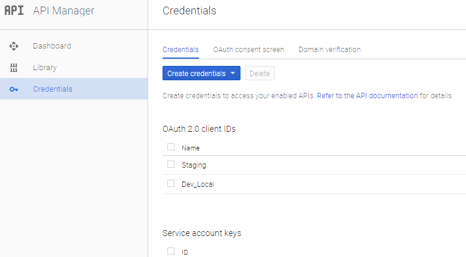
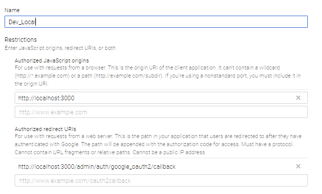
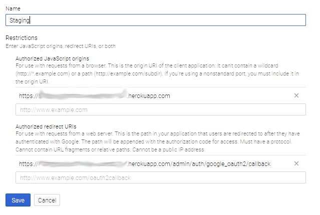
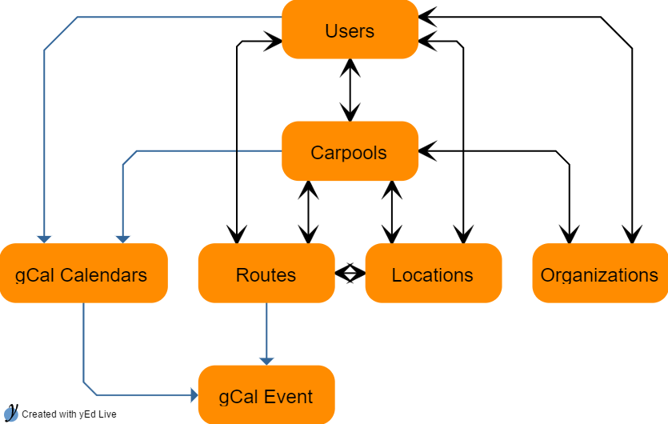

# Carpool Server

A Carpool System integrating Ruby On Rails and Google Calendar APIs on Heroku

## Overview

This system helps carpool members stay up to date on their assignments by maintaining a group of individualized google calendars.  The web server enables a carpool "manager" or "admin" to maintain route assignments and to drag and drop routes within a web based calendar interface.  Upon any update, the appropriate calendars' events will get synchronized.  

## Features

- Members need only know how to setup and integrate a google calendar to their device.

- Multiple private calendars are auto-maintained:

  - **MyCarpool** - showing every event for the MyCarpool carpool.

  - **MyOrg (MyName)** - showing all events assigned to just that user and occurring within any carpool associated with MyOrganization.

- Calendars are read-only and auto-managed by the server, so nothing to screw-up by anyone.

- Route details are inserted within an event's description field:
    ~~~~text
    Driver(s):
    Jim LastName (555) 555-1111
    _________ 4 Passengers: _________
    Lucas LastName (555) 555 2222
    Bodhi LastName (555)  555-3333
    Marsha LastName (555) 555-4444
    Julian LastName (555) 555-5555
    ~~~~

- Within week view, "Missing" button toggles a display showing "active" passengers without at least 2 rides within a day.

- Members can now be set to "Resting" to temporarily disable them from participating in a carpool, but still allowing them to see the calendar.

- All updates propagate almost instantaneously to all members.

- Host for free on Heroku.

- Drag and drop routes

- Detailed Setup Instructions


## Video Walkthrough
[Video Video on Vimeo](https://vimeo.com/212628156)

## Background

The system grew out of the need for a group of parents to orchestrate rides for their children to a distant school. The group initially decided that a volunteer carpool "Manager" should deal with all the scheduling and issues that come up via email and then send out a weekly schedule.   As changes would occur throughout the week, the emails would fly..  Having more than 30 people on an email list and having to sift through all the special requests, and changes like "I can't drive Tuesday because...", "I'll pick up here instead", etc., became somewhat of a waste of time.  Most would not just email the manager first to see if it could be resolved quietly.  So lots of unnecessary communications were happening and the initial manual spreadsheet type of documentation would quickly get out of sync with reality, besides being tedious to maintain.  

After trying to piggyback on top of some other more general outlining and task management type cloud based collaborative systems, and after realizing how low the bar really had to be, in order for carpool members to actually interact with any type of system, I rolled my own.  It centers around having that same manager be responsible for sifting through the email requests, but provides a way for them to easily manage the changes via a drag and drop browser based calendar UI. The system maintains individualized google calendars for each user, whose events are updated and propagated in real time.  This allows members of the carpool to feel confident that their responsibilities or needs are clear, regardless of whatever changes are going on.

In starting this project, I found that most carpool members won't want to do anything special or at all when it comes to new behaviors. That knocked out most process and workflow oriented semi-manual solutions.  So the idea that the system should be as simple as possible and involve the members as little as possible, was the key take away for me and I hope a guiding principle as this project evolves.

### Use of Google Accounts

 Because these calendar events contain private information, such as names, phone #s, and addresses, it should be requested that all members provide a Google account for calendar access.  These accounts are free and are now deeply integrated into most current devices.  Using these accounts allows the system to utilize a common access control on these calendars.  Members should be informed that it's not a requirement that they use gmail or google mail, just that they have one and that they've enabled the "Calendar" option for that account, within the Accounts Settings on their computer or device.  This will allow the calendar to just automatically appear within whatever calendar app that they use for their scheduling. (one extra step for apple devices)

 It is possible for members, who do not want to provide a gmail account email, to still be in the system.  They just won't be able to have their Google calendar sync option enabled, so no calendars will get maintained for them.

## Typical Workflow

The current workflow around which this system has been most tested, focuses on this single "manager" who actually interacts with the system.  It's their job alone to use the UI to maintain the routes and transfer any new carpool changes from an email or casual conversation.  Any changes done through the web UI, will automatically synchronize to the calendars.

Though it's currently possible for any member to login and manage their own data (3 roles currently exist, :admin, :manager, and peon), it's suggested that you stick to the Workflow scenario outlined below where a manager does most everything, just to stay within a more fully tested space.  

The typical workflow goes like this:

Admin:

- Complete [Installation](#installation) section below
- use UI to assign a user as *Manager* for a carpool

Manager:

- use UI to: tweak the name for the Organization and Carpool
- add/update Members' names, phones, google based accounts (gMail / Google Apps)
- add/update Locations

Admin:

- For each Member with a google account, enable that user's google sync option.

> Currently only the Admin has permission to toggle a user's google sync option.  Enabling, immediately triggers an email from the google service account to that specific user, informing them of a new google shared calendar.  The reason for this restriction by only Admin, is that you may not want managers to turn this option on and off a bunch of times, without being aware of the impact that it could have on members. The share notifications are automatically sent upon changing that option in the UI and appear in their email from a weird google email address.  It's best to be careful if you want to have people adopt the system.  

Manager:

- update routes for the week
> drag the mouse inside the calendar across a span of time.  Right click an event to delete/copy/paste.
- Send out an email saying, take a look in your calendars, everything look OK?

Users:

- emails Manager and says my phone is wrong.

Manager:

- update the user's phone number and the system will automatically update every route event that that user is in and update the new phone number within those routes' event description fields.

## Installation

In order to get the carpool server running both locally and on Heroku, you'll need to have these components installed and configured:


- [Bower](https://bower.io/#install-bower) with Node, NPM, and GIT,  for building javascript
- [Ruby on Rails 4.2](http://guides.rubyonrails.org/v4.2/) via a ruby version manager
- [Account for Heroku](https://id.heroku.com/login) production hosting
- [Account for Managing Google APIs](https://console.developers.google.com/apis/dashboard)

For local Development: I've used OSX and now [WSL on Windows](https://msdn.microsoft.com/en-us/commandline/wsl/faq) (the Aug 2016 stablish beta release) works for me)

Follow the setup for the following sections to complete Installation of the Carpool server. It will step you through setting up the various cloud accounts and configuring the server via credentials and execution of a few rake tasks that were created to ease the setup process.

### Google API Setup

1. [Create a new Google API Project](https://console.developers.google.com/apis/dashboard)

1. Under *Library*, Enable the following APIs:
    - Google+ API
    - Contacts API

1. Under *Credentials*, create 2 Service Accounts and download credentials as JSON

1. set **MY_SERVICE_ACCOUNT_JSON** within application.yml (:development and :production) with that JSON

1. Create 2 Oauth 2.0 Client IDs (for both development and production) and save generated keys

1. update application.yml for:
    - GOOGLE_CLIENT_ID
    - GOOGLE_CLIENT_SECRET

    
    This is for server logins via google, which is not really necessary as you can login using username/password too

1. Set the *Callbacks*

    Local Dev should look like this:
    

    Staging or Production should look like this:
    

### Local Development Setup

1. Install and Obtain [Postgres DB](https://www.postgresql.org/) Credentials

1. Git carpool project
    ```bash
    git clone https://github.com/JimW/carpool-on-rails.git
    ```
1. cd into the carpool's project folder
1. Copy config\application.yml.sample to config\application.yml
1. Generate new secrets and place into secret_key_base for all environments
    ```bash
    rake secret
    ```
1. In application.yml set the following
    - DATABASE_NAME (for dev)
    - DATABASE_USERNAME (for dev)
    - DATABASE_PASSWORD (for dev)

1. Rename db/development_sample directory to db/development

1. Edit db/development/seeds/seed_data.yml. Populate with only a single organization and a single Carpool. Leave the whole file as is if you're just starting off.  Eventually you'll want to prepopulate it with valid google email accounts.  Leave the Lobby entry alone as it needs to be named "Lobby".

1. For bower-rails gem:
    ```bash
    sudo apt-get install nodejs
    sudo apt-get install nodejs-legacy
    ```
1. Install Ruby
    ```bash
    rbenv install 2.2.6
    ```
1. Install Bundler
    ```bash
    gem install bundler
    gem install nokogiri -- --use-system-libraries
    bundle install
    ```
1. Install [node](https://nodejs.org/en/download/package-manager/#debian-and-ubuntu-based-linux-distributions) so you can use bower (I'm using WSL on Windows for unix)
    ```bash
    sudo npm install -g bower
    ```
1. Deal with all the javascript
    ```bash
    bundle exec rake bower:install
    ```
1. Reset DB and Delete all Google Calendars previously created by Service Account,  *Caution...*  Take a look inside this rake task.  Within it, it calls aws:plant_seeds for storing the seed data on AWS S3 for use by Heroku, if it finds an AWS_S3_SEED_DIR_PATH path set within your ENV. Otherwise, the seeds.rb will just seed using data from db/seeds/development/seed_data.yml
    ```bash
    bundle exec rake db:rebuild_dev
    ```
1. Start the local rails server

    ```bash
    rails s
    ```

## Web UI

1. Login using admin@xx.com at [localhost:3000](http://localhost:3000/)

1. Add or edit default users and assign one as "Manager" for a carpool

1. Update the Organization and Carpool details

1. Login as a Manager to test

1. Enable Google Sync on your account and for the Carpool as a whole

### Google Calendar Sync Options

To actually have the system manage any Google Calendars, you need to enable the Google Calendar sync options in 2 places within the web interface.

1. **Carpool edit screen** there is an option there.  Toggling this option will create a single calendar to be shared with each member in the carpool that has their option turned on. This will initiate an email from google informing them of the shared calendar.  Turning it off will remove the calendar.  Each time you do this, a separate calendar will get created and another

1. **Within a user's profile**, a Gmail address should be used, which the carpool server uses to create and manage 2 carpool related calendars. One that contains just the routes assigned to that user and across all carpools of the organization and a single shared calendar, that contains the entire schedule for the carpool group.  Usually a member would only have viewable one or the other.

So if user is a member of 2 carpools within an organization, "Commute Carpool" and "Basketball Carpool" for "dTechOrg", they will have 3 read-only shared calendars made available to them by the system, if both these google sync options are turned on.  Turning off the sync, will remove any of these calendars from their google account.


## Amazon S3 Setup

1. Setup an [Amazon S3 Bucket](https://console.aws.amazon.com/s3/home) and associate within a user's credentials that you want to use for the carpool via [IAM](https://console.aws.amazon.com/iam/home#/home), the following policy for that bucket:
```json
{
    "Version": "2012-10-17",
    "Statement": [
        {
            "Effect": "Allow",
            "Action": [
                "s3:PutObject",
                "s3:GetObject",
                "s3:GetObjectVersion",
                "s3:DeleteObject",
                "s3:DeleteObjectVersion"
            ],
            "Resource": [
                "arn:aws:s3:::yourbucketnamewithnospecialcharacters/*"
            ]
        }
    ]
}
```

You'll need to set the AWS_ACCESS_KEY_ID and AWS_SECRET_ACCESS_KEY for this user within ENVs mentioned below.

## Heroku Setup

### [Heroko](https://id.heroku.com/login) Staging Server

1. [Install Heroku Command Line Interface](https://devcenter.heroku.com/articles/heroku-command-line)

    *(If using Windows WSL, install it for Windows and use Powershell to interact with Heroku)*

1. cd into project directory

1. Create Heroku Project *(This create a project on Heroku and adds a branch named staging for you in git)*

    ```bash
    heroku create YOUR_UNIQUE_PROJECT_NAME --remote staging
    ```

1. Provision a hobby-dev plan database:
    ```bash
    heroku addons:create heroku-postgresql:hobby-dev --remote staging
    ```
    or

    Under **Resources** in Heroku dashboard, search for and add **"Heroku Postgres"** Database and add **"Hobby Dev - Free"**

1. Enable Ruby and Node on your Heroku project by specifying buildpacks:
    ```bash
    heroku buildpacks:set  https://github.com/heroku/heroku-buildpack-multi.git --remote staging
    ```

1. Push Production secrets from your application.yml to your Heroku app's environment variables (untested as this won't work in Windows WSL)

   ```bash
   figaro heroku:set -a YOUR_HEROKU_APP_NAME -e production
   ```
    or

    Under Settings, Reveal Config Vars, Set these ENV Vars as follows (see sample application.yml):
    ```json
        SECRET_KEY_BASE: "xx"
        RACK_ENV: "production"
        RAILS_ENV: "production"
        RAILS_SERVE_STATIC_FILES: "enabled"

        DEVISE_SECRET_KEY: can use SECRET_KEY_BASE
        GOOGLE_CLIENT_ID: <Paste downloaded Credentials>
        GOOGLE_CLIENT_SECRET: <Paste downloaded Credential>
        MY_SERVICE_ACCOUNT_JSON: <Paste entire text from downloaded SERVICE ACCOUNT JSON Credentials>

        AWS_ACCESS_KEY_ID: '<>'
        AWS_SECRET_ACCESS_KEY: '<>'

        AWS_S3_BUCKET: 'yourbucketnamewithnospecialcharacters'
        AWS_S3_SEED_DIR_PATH: 'seeds/heroku_staging or seeds/heroku_production'

        DATABASE_URL: "AUTO SET BY HEROKU"
        MAX_THREADS: 2
        DB_POOL: 4
        LANG: "en_US.UTF-8"
    ```
    You could also potentially use the Heroku API to push these all up at once using curl..

1. Push the project to Heroku
    ```bash
    git push staging master
    ```
1. Reset Production Database (be careful..)
    ```bash
    heroku pg:reset DATABASE --remote staging
    ```
1. Update Production DB
    ```bash
    heroku run rake db:migrate --remote staging
    ```
1. Be sure your local db/seeds/development/heroku_staging/seed_data.yml contains the seed data you want.

1. if ENV['AWS_S3_SEED_DIR_PATH'] is set, this task will translate:  db/seeds/development/heroku_staging/seed_data.yml to json and push to that AWS path.
    ```bash
    bundle exec rake aws:plant_seeds
    ```
Look inside this task for altering source seed file paths

1. Seed the Heroku DB (be careful..) If ENV['AWS_S3_SEED_DIR_PATH'] is set within Heroku, seeds.rb will look for seed data you previously planted on AWS.
    ```bash
    heroku run rake db:seed --remote staging
    ```
1. Should be good when you navigate to your heroku project's url

### [Heroko](https://devcenter.heroku.com/articles/fork-app) Forking a Production Server

1. Either fork your existing staging app on Heroku (useful if you want to copy a Postgresql db without upgrading) or go through the prior steps again for --remote Production

1. Ensure your ENVs are unique for production
*warning: once a service account is used in production, stick with a credential associated with that same account.  Otherwise you'll need to toggle all the calendars to regenerate any events and calendars*

## System Details

The system manages and tracks the relationships between these entities:



Image available in support_docs/carpoolGraph.graphml via [yed-live](https://www.yworks.com/yed-live/)

The real value of this system, besides maintaining the relational data, is that any changes made within or between the Organizations, Carpools, Users, Routes, and Locations, can trigger updates within these relationships.  Currently, these triggers are focused on initiating calls to the Google Calendar APIs, in order to modify the associated calendar events.  Having a base system like this allows for many opportunities for expansion and integration with other cloud services.  

The following are some of the components used in this project:

- [ActiveAdmin](https://activeadmin.info/)

- [FullCalendar](https://fullcalendar.io/)

- [Pundit](https://github.com/elabs/pundit) and [Rolify](https://github.com/RolifyCommunity/rolify) gems are used for restricting access

- Backend Jobs via Active Job and [sucker_punch]( https://github.com/brandonhilkert/sucker_punch)
  - Keep the # of threads(workers) < 3 for Heroku free.

- Some webcal calendar support, available via a calendar page that is available to non-managers, is in the code but it's not used.  I gave up on the idea of having the server serve up calendars directly to members, as I was unable to reliably ensure people's calendar update frequencies within whatever calendar app they use.  Could be once a week..  There is a app/admin calendar.rb file that serves this up.  It's menu is set to false now so it won't show up unless a peon logs in.

- Concept of Lobby and Organizations is incomplete so I disabled org editing for now. Idea was for every member of an org to be in a lobby at least, so they can at least exist outside of a carpool. Probably easier to just install this server for each organization. So for now, Just use a single Organization.

## Google API Details

- [Google Developer Account](https://console.developers.google.com/apis/dashboard) for access to [Google APIs](http://www.rubydoc.info/github/google/google-api-ruby-client/)

- You can look at the Error events within the Google API Dashboard.

- Google does not really delete calendar events, but marks it as cancelled (because google remembers everything you give it..), keep that in mind if you reuse an id which will happen if you refresh the development or staging databases but don't delete and recreate any generated google calendars.  The event_ids that are sent to google will restart at 1 and when you try and insert it will fail with an "already exists" error (although it's been marked as deleted).  I'm not really passing in a guaranteed to be unique universal resource ID right now, but it's not really necessary if you run the rake task, rebuild_dev, that will reset the db AND also delete all the google calendars.  A work around was to retry as an update for that particular type of failed insert.. The code for doing this is remmed out.  Instead of deleting the event, it moves them to a trash calendar.  Not really important now if you use the rebuild_dev task while developing, just saying..

    - ```bundle exec rake gs:delete_all_calendars``` can be used to wipe out all the calendars within an environment's service account. It is called within rebuild_dev and should be done whenever you reset the db.

## Staging vs Production

  [from Heroku](https://devcenter.heroku.com/articles/deploying-to-a-custom-rails-environment)

  > "It may be tempting to create another custom environment such as “staging” and create a config/environments/staging.rb and deploy to a Heroku app with RAILS_ENV=staging. This is not a good practice. Instead we recommend always running in production mode and modifying any behavior by setting your config vars.

  > ...

  > Your “staging” app or any other custom environments should be run with RAILS_ENV=production to minimize differences in behavior. Environment variables should be used to configure your application to achieve different behavior when desired instead of a custom environment."

  So [fork a project in Heroku](https://devcenter.heroku.com/articles/fork-app) and make sure all the Google credentials are unique between both Staging and Production, but keep both set with **RAILS_ENV = production**.

The google Service Account holds everyone's calendars, so be sure to only put the **Staging** credentials within the production section of application.yml.  This is important when you run any rake tasks below that manage google calendars or the DB directly.

  ## Special Rake Tasks
  ### Resetting Google Calendars on STAGING

  Executing the following from the local command line, will delete all google calendars associated with the google service account associated with staging and not production, as long as your production ENVs are those of staging.  Don't keep real production related ENVs in your local application.yml, only staging.

  ```bash
  RAILS_ENV=production bundle exec rake gs:delete_all_calendars
  ```

  ### Setting Seed Data for Heroku
  if ENV['AWS_S3_SEED_DIR_PATH'] is set, this task will translate:  db/seeds/development/heroku_staging/seed_data.yml to json and push to that AWS path.
  ```bash
  RAILS_ENV={development or production} bundle exec rake aws:plant_seeds
  ```

  ### Resetting the Local Dev DB and Google Calendars

  This task will reset and seed the Development Database and destroy all calendars associated with the Development Google Service Account.  The seed file is extracted from the AWS S3 directory defined in ENV['AWS_S3_SEED_DIR_PATH']

  ```bash
  bundle exec rake db:rebuild_dev
  ```
  *Careful when doing this, as it will force any members who have already associated their carpool calendars within their phones, to have to do it again.*

## NOTES

The server is not really tested for allowing multiple users to log into the server themselves.  Though a most of the logic is in place, it's currently intended for a single "manager" or "admin" to manage everything. Extra code is necessary if you want a non-manager to be able to edit just their own routes and info. It might be easier to create a separate UI for them, as their interactions will be simpler, "need/no_need for ride" on "date", etc.

### Routines

Route Templates were never really used, but is mostly there and working.  The idea was to easily turn a typical (:special) instance into a template and appear within week view at the top of the calendar within "Routines".  If that routine is implemented, it will be green and it's instance will be green.  If that instances is altered it will turn yellow.  If the instance is dragged to another day, it will be broken from the routine and appear as a non-template instance (a :special) and is orangish-red.  Currently the Routine itself is treated as a regular instance in the DB, so does not appear in subsequent weeks and is why it's incomplete in it's implementation.  I choose to do away for the idea for now, as it is pretty easy to just drag and drop routes from previous week (when looking at the calendar in month view mode). Doing so will retain that route's actual pickup time.  

But once the concept of a Routine is in place, scheduling for following weeks will be easier and being able to act on special situations will be more possible (auto SMS/mail the details of exceptions to only those affected)

### Miscellaneous

Batch actions (for Delete) should work on heroku, but not locally for some JSy reason.

## TODO

- Add Google Analytics config just for fun

- If already logged in, being sent to read-only calendar page instead of Routes page

- Bundler warning when pushing to heroku, version mismatch

- Organization Pages
  - Org Crashes on Delete (use just a single organization for now)
  - Add current_org to User maybe within organization_users (useful for Admin at least right now)
  - Enable multiple Orgs? Not sure I want to scale that far..

  ```ruby
  class AddCurrentOrganizationToUsers < ActiveRecord::Migration
      def change
        add_column :users, :current_organization_id, :integer
      end
  end
  ```

    - Renaming org.title_short won't propagate to calendars


- Carpool Page
  - Add a has_one lobby to Carpool instead of all this "Lobby" stuff in the code, but make sure that association is a carpool with "Lobby" as the name, fix up all the Lobby code accordingly
  - upon deletion of Carpool, need to disable google sync first.
  - Carpool model -> short_name, title_short (pick one..)
  - Give more resolution into Access rights, allow for manger for specific carpool
  - Renaming Carpool will not rename associated google calendars' titles
  - Renaming carpool won't propagate to calendars, also it's using title vs title_short in calendars


- Route Page
  - Feature of assigning multiple drivers, was meant for implementing backups.  Maybe Disable in UI until feature fully is implemented.


- Members Page


- UI
  - Should add some kind of "are you sure" when deleting events, especially in batch
  - Set_current_carpool should be available as dropdown at highlevel in UI
  - Route Templates is only partially implemented. Need to think this through more
    - Have Routine must be associated with day of the week and it's instances behave in a way that makes sense relative to their actual date instance. There can be multiple instances with varying states. get_events
  - Maybe Change the peon role to not even let them update their own info
  - Try and consolidate the 3 seperate web requests for the calendar into 1, constraint may be with Fullcalendar though.. (3 are related to types of events, was important for template stuff)
  - In User UI, Make Role a radiobox instead of checkbox
  - For Admin role, add access to some GCal Service Utils from Carpool UI
  - FullCalendarJS 3.x does not work for some reason
  - Show Roles in User index
  - Add configuration option for # days in week (5 vs 7), starting day, etc
  - Want to change text to "Log in with Google". Not sure Why Devise views are not able to be overridden.


- Google Calendars
  - Add ability to track gcal errors. (Surprisingly, there are few to none) Need better capture and recovery
    - to_be_deleted? for Org, Carpool, Route.  Only after all related google events are deleted, should they be actually destroyed.
      - ```t.boolean  "to_be_deleted",     default: false```
      - Will need to shift some before_destroy type code into:
        - cancel_route_events, cancel_org_carpools, cancel_carpool_routes.
        - Add check for !to_be_deleted? everywhere they're being pulled up
  - Add calendar service utils for Calendar Service Account (All these should be inside workers/jobs)
    - ListAllCalendars
    - DelAllCalendars
    - DelAllEvents(Cal), I think there was a way to actually delete them for real? Maybe not, it's google...
  - Be sure no throttling is enforced with Google APIs (important maybe during batch deletes)
  - Add google batch to more Jobs, constraint is that each must all work on single calnedar

- Tests and Rakes
  - GCal services


- DB
  - Enabling users with google_sync option when seeding db, probably does not work. need to verify and fix


- Email
    - Add ability to send email
    - Put the following member instructions into a template email and send to user upon being added to a carpool:

```txt
blah blah

If you don’t use Gmail for mail, you don’t need to, you can just enable the calendar component of your google account on your computer or phone.

By default 2 calendar shares were made available to you.  One contains the entire carpool schedule with everyone’s assignments and another with your name in it’s title, contains just your assignments.   There is nothing you have to do to accept the shared calendars.  The email you received with a weird google address is simply a notification that is automatically sent, informing you that you now have a shared calendar available to you.  If it annoys you having these calendars, simply disable or delete them and they will be gone from your google calendar.  If you later need them again though, let me know and I push a button to delete and recreate them for you.  You’re better off just disabling the calendar that you don’t want to see.

If you want access to a google calendar via an apple device, you‘ll need to go [here](https://calendar.google.com/calendar/syncselect?pli=1): This makes the additional carpool related google calendars available on your iPhone.  Enable BOTH of the carpool calendars here.  Then just enable/disable the ones you want within your iPhone.  You probably want both at least available on your phone.
```

- Worker Jobs
  - Implement after_perform to update the status in DB
  - Need to break more of the blocking loops into seperate Jobs Not sure how many job threads a free Heroku instance can handle.  I think it's only 2.
  - Heroku Free has limitations on it's extra process that is now free. Keep eye on this.  Would like to use AWS SQS instead of RAM based stuff.

## Code Standards

- Keep it simple for members
- Some kind of auto code formating ??? like VS has? Tricky right now with ruby on WSL and Windows editors.

## License

MIT License

Copyright (c) 2017 Jim Waterwash

Permission is hereby granted, free of charge, to any person obtaining a copy
of this software and associated documentation files (the "Software"), to deal
in the Software without restriction, including without limitation the rights
to use, copy, modify, merge, publish, distribute, sublicense, and/or sell
copies of the Software, and to permit persons to whom the Software is
furnished to do so, subject to the following conditions:

The above copyright notice and this permission notice shall be included in all
copies or substantial portions of the Software.

THE SOFTWARE IS PROVIDED "AS IS", WITHOUT WARRANTY OF ANY KIND, EXPRESS OR
IMPLIED, INCLUDING BUT NOT LIMITED TO THE WARRANTIES OF MERCHANTABILITY,
FITNESS FOR A PARTICULAR PURPOSE AND NONINFRINGEMENT. IN NO EVENT SHALL THE
AUTHORS OR COPYRIGHT HOLDERS BE LIABLE FOR ANY CLAIM, DAMAGES OR OTHER
LIABILITY, WHETHER IN AN ACTION OF CONTRACT, TORT OR OTHERWISE, ARISING FROM,
OUT OF OR IN CONNECTION WITH THE SOFTWARE OR THE USE OR OTHER DEALINGS IN THE
SOFTWARE.

Portions of this code are licensed and copyright as follows:
FullCalendar (Standard Edition) - © 2017  FullCalendar LLC
Fullcalendar-Rails_Engine - Copyright (c) 2014 vinsol.com, released under the New MIT License
